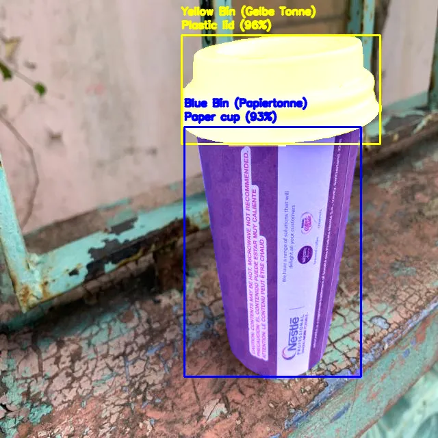
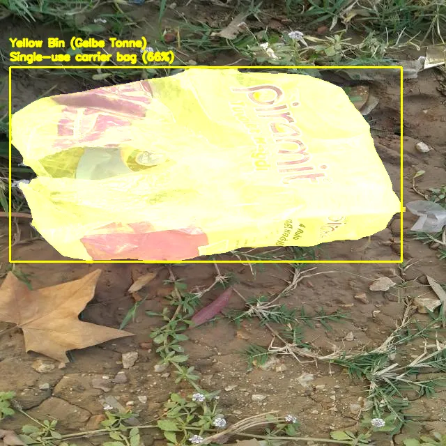

---
title: Mülltrenner9000
emoji: ♻️
colorFrom: blue
colorTo: green
sdk: gradio
sdk_version: "5.34.2"
app_file: app.py
pinned: false
---

# Mülltrenner9000 ♻️  
**Bin there, sorted that.**

An instance segmentation app for waste classification, built with Gradio and YOLOv11.

Mülltrenner9000 is a smart instance segmentation web app that classifies and segments waste into **59 categories**, recommending the correct **German recycling bin**—such as Gelbe Tonne, Restmüll, or Pfand—based on real-time object detection.

The model uses a fine-tuned **YOLOv11 segmentation** model (YOLO11m-seg) and offers an interactive Gradio-based UI for waste classification and bin assignment.

---

🔗 **Try it on Hugging Face Spaces**: [Mülltrenner9000 – Hugging Face Space](https://huggingface.co/spaces/Yas1n/mulltrenner9000)

---
## 🧠 What It Does

- ✅ **Instance Segmentation** of individual waste items
- ✅ **Classification** into correct bins:
  - **Yellow Bin (Gelbe Tonne)** – Plastics & Metals 
  - **Grey Bin (Restmüll)** – General Waste
  - **Green Bin (Biotonne)** – Biodegradable Waste 
  - **Blue Bin (Papiertonne)** – Paper & Cardboard 
  - **Glascontainer** – Glass Waste
  - **Hazardous Waste (Sondermüll)** – e.g. Batteries, Chemicals
  - **Deposit Return (Pfand)** – Refundable items
- ✅ **Real-time segmentation masks** with bin color overlays and labels

---

## 🗂 Dataset

- **Source:** [TACO: Trash Annotations in Context (Roboflow)](https://universe.roboflow.com/mohamed-traore-2ekkp/taco-trash-annotations-in-context/dataset/15)
- **Annotations:** Pixel-level masks + class labels
- **Images:** 3147 for training, 299 for validation
- **Classes:** 59 object types

---

## 🛠 Model Training

- **Model**: [YOLOv11 (YOLO11m-seg)](https://github.com/ultralytics/ultralytics)
- **Backbone**: Fine-tuned with heavy data augmentation (RandAugment, CLAHE, etc.)
- **Epochs**: Trained for 70 epochs
- **Batch Size**: 16
- **Optimizer**: SGD
- **Learning Rate**: Final stage LR tuned to `0.001`
- **Mixed Precision**: AMP enabled

---

## 🖼 Sample Output

Here is a sample segmentation and classification output of Mülltrenner9000:

---

## 🤝 Contribution

We welcome contributions from the community, whether it's in the form of bug reports, improvements, documentation, or new features.

---

## 📄 License

This project is licensed under the **MIT License**. See the `LICENSE` file for more details.